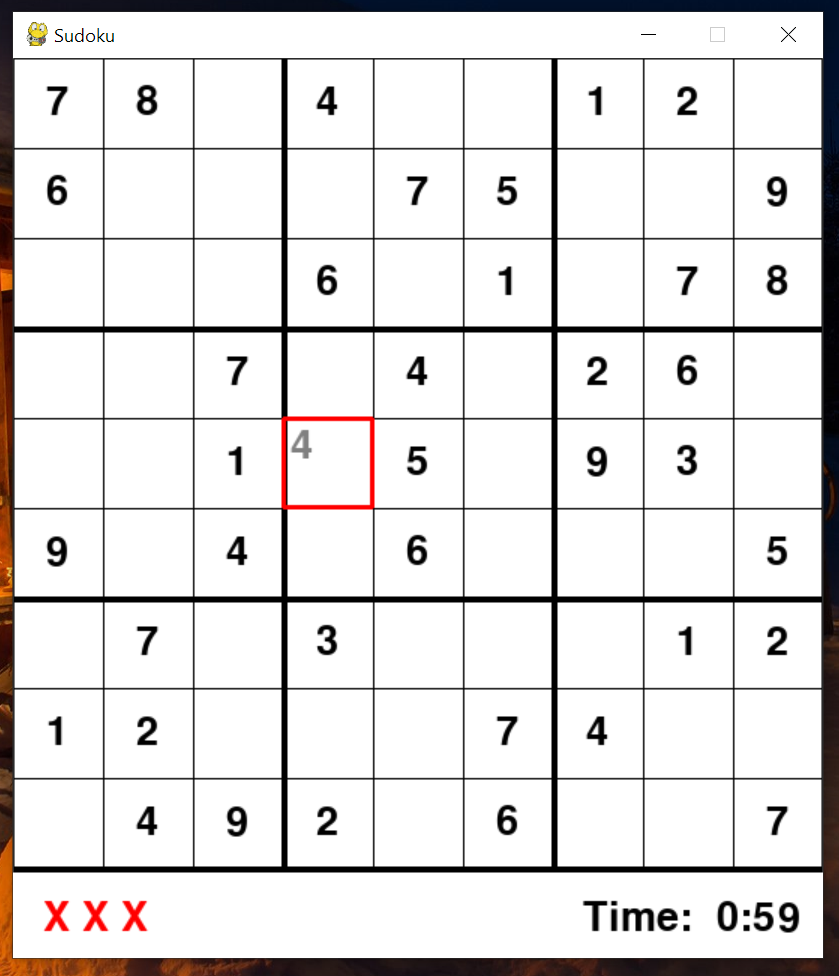

# Sudoku Game & Solver

## Screenshots

## Inspiration
While learning new algorithms and practicing them, I came across the backtracking algorithm and wanted to implement it. I read online a bit and found it could be quite useful in solving sudoku puzzles. Hence I set on to creating a sudoku game first using Pygame library and then implementing the solver feature which can solve any solveable game with optimal efficiency as compared to iterative approach.
## How To Use
 - Run Sudoku-Game.py to play the normal sudoku game
 - Click on an empty cube, write a number and hit enter. If the number is valid it will be placed permanently, otherwise, a strike will appear at the bottom
- The solver feature is used to compare the input number with the solved model. However, to use the solver manually, open the solver.py file and edit the board var to any sudoku puzzle and run the file. The solved puzzle will be displayed in terminal/command line

## End
